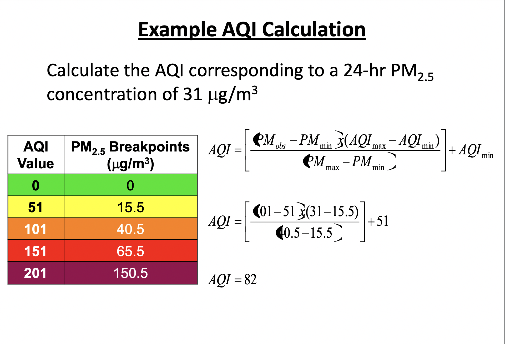

Suppress messages for this markdown

```{r setup}
knitr::opts_chunk$set(message = FALSE, warning = FALSE)
```

## Preparing data

### Uploading libraries

```{r}
#uploading libraries
library(dplyr)
library(tidyverse)
library(pdftools)
library(stringr)
library(lubridate)
library(readr)
library(ggplot2)
library(gridExtra)
library(janitor)
library(rvest)
library(stringr)
library(stringi)
library(finalfit)
library(skimr)
library(gtsummary)
```

### Boston government website data

Reading in data from the [Boston.gov website](https://data.boston.gov/dataset/property-assessment) on property financial assessment for years 2017 to 2021:

```{r}
eval2017<-clean_names(read_csv("https://data.boston.gov/dataset/e02c44d2-3c64-459c-8fe2-e1ce5f38a035/resource/062fc6fa-b5ff-4270-86cf-202225e40858/download/property-assessment-fy2017.csv"))

eval2018<-clean_names(read_csv("https://data.boston.gov/dataset/e02c44d2-3c64-459c-8fe2-e1ce5f38a035/resource/fd351943-c2c6-4630-992d-3f895360febd/download/ast2018full.csv"))

eval2019<-clean_names(read_csv("https://data.boston.gov/dataset/e02c44d2-3c64-459c-8fe2-e1ce5f38a035/resource/695a8596-5458-442b-a017-7cd72471aade/download/fy19fullpropassess.csv"))

eval2020<-clean_names(read_csv("https://data.boston.gov/dataset/e02c44d2-3c64-459c-8fe2-e1ce5f38a035/resource/8de4e3a0-c1d2-47cb-8202-98b9cbe3bd04/download/data2020-full.csv"))

eval2021<-clean_names(read_csv("https://data.boston.gov/dataset/e02c44d2-3c64-459c-8fe2-e1ce5f38a035/resource/c4b7331e-e213-45a5-adda-052e4dd31d41/download/data2021-full.csv"))

```

Cleaning up names of variables (2021 had some different ones), limiting data to residential property only, selecting for variables of interest:

_Note:_ Codebook can be found on the City of Boston [website](https://data.boston.gov/dataset/property-assessment/resource/bac18ae6-b8fd-4cd3-a61c-c5e1a11f716c).

```{r}
eval2017res <- eval2017 %>% 
  filter(lu %in% c("A", "CD", "CM", "R1", "R2", "R3", "R4", "RC")) %>% # Lu refers to type of property; limiting data to residential property only
  mutate(st_name = paste(st_name, st_name_suf)) %>%  #Match format of addresses to those in 2021 dataset
  mutate(ac_type = ifelse(!is.na(r_ac), r_ac, u_ac)) %>% # Different variables used for residential properties (r) and units (u), so this is code to unify them into one variable
  mutate(heat_type = ifelse(!is.na(r_heat_typ), r_heat_typ, u_heat_typ)) %>% 
  mutate(heat_type = replace(heat_type, heat_type == "C", NA), #Removing heat types not in codebook
         heat_type = replace(heat_type, heat_type == "D", NA), 
         heat_type = replace(heat_type, heat_type == "f", NA), 
         heat_type = replace(heat_type, heat_type == "G", NA), 
         heat_type = replace(heat_type, heat_type == "I", NA), 
         heat_type = replace(heat_type, heat_type == "Y", NA)) %>% 
  mutate(bedrooms = ifelse(!is.na(r_bdrms), r_bdrms, u_bdrms)) %>% 
  mutate(bath_full = ifelse(!is.na(r_full_bth), r_full_bth, u_full_bth)) %>% 
  mutate(bath_half = ifelse(!is.na(r_half_bth), r_half_bth, u_half_bth)) %>% 
  rename(condition = r_ovrall_cnd) %>% 
  mutate(pid = str_sub(pid, 1, 10)) %>% #String processing to reformat number IDs
  mutate(zipcode = as.character(str_sub(zipcode, 1, 5))) %>% #changing zipcode to character without dash at the end
  select(zipcode, av_bldg, av_land, av_total, st_name, pid, gross_tax, land_sf, living_area, lu, num_floors, ac_type, heat_type, bedrooms, bath_full, bath_half, condition, yr_built, yr_remod) %>%  #Keeping assessed value for the building, land, and total. Keeping address (st_name) and parcel numbers for reference (pid). Keeping tax bill amount (based on av_total and tax rate), square footage of land and living area. Keeping type of property. Keeping property-level factors: number of floors, presence of AC and heat (types), number of bedrooms, number of full and half bathrooms, overall condition, year built, year remodeled
  mutate(year = 2017) #Creating a year variable for year of assessment
  
eval2018res <- eval2018 %>% 
  filter(lu %in% c("A", "CD", "CM", "R1", "R2", "R3", "R4", "RC")) %>% 
  mutate(st_name = paste(st_name, st_name_suf)) %>%  
  mutate(ac_type = ifelse(!is.na(r_ac), r_ac, u_ac)) %>% 
  mutate(heat_type = ifelse(!is.na(r_heat_typ), r_heat_typ, u_heat_typ)) %>% 
  mutate(heat_type = replace(heat_type, heat_type == "C", NA), 
         heat_type = replace(heat_type, heat_type == "D", NA), 
         heat_type = replace(heat_type, heat_type == "f", NA), 
         heat_type = replace(heat_type, heat_type == "G", NA), 
         heat_type = replace(heat_type, heat_type == "I", NA), 
         heat_type = replace(heat_type, heat_type == "w", NA), 
         heat_type = replace(heat_type, heat_type == "Y", NA)) %>% 
  mutate(bedrooms = ifelse(!is.na(r_bdrms), r_bdrms, u_bdrms)) %>% 
  mutate(bath_full = ifelse(!is.na(r_full_bth), r_full_bth, u_full_bth)) %>% 
  mutate(bath_half = ifelse(!is.na(r_half_bth), r_half_bth, u_half_bth)) %>% 
  rename(condition = r_ovrall_cnd) %>% 
  mutate_at(vars(gross_tax, bedrooms), as.numeric) %>% # Making some numbers from character to number class to match the other years
  select(zipcode, av_bldg, av_land, av_total, st_name, pid, gross_tax, land_sf, living_area, lu, num_floors, ac_type, heat_type, bedrooms, bath_full, bath_half, condition, yr_built, yr_remod) %>% 
  mutate(year = 2018)

eval2019res <- eval2019 %>% 
  filter(lu %in% c("A", "CD", "CM", "R1", "R2", "R3", "R4", "RC")) %>% 
  mutate(st_name = paste(st_name, st_name_suf)) %>%  #Match format of 2021
  mutate(ac_type = ifelse(!is.na(r_ac), r_ac, u_ac)) %>% 
  mutate(heat_type = ifelse(!is.na(r_heat_typ), r_heat_typ, u_heat_typ)) %>% 
  mutate(bedrooms = ifelse(!is.na(r_bdrms), r_bdrms, u_bdrms)) %>% 
  mutate(bath_full = ifelse(!is.na(r_full_bth), r_full_bth, u_full_bth)) %>% 
  mutate(bath_half = ifelse(!is.na(r_half_bth), r_half_bth, u_half_bth)) %>% 
  rename(condition = r_ovrall_cnd) %>% 
  mutate(zipcode = as.character(zipcode)) %>% 
  mutate(zipcode = paste0("0",zipcode)) %>% #Change zipcode to a character and add a zero to the front
  select(zipcode, av_bldg, av_land, av_total, st_name, pid, gross_tax, land_sf, living_area, lu, num_floors, ac_type, heat_type, bedrooms, bath_full, bath_half, condition, yr_built, yr_remod) %>% 
  mutate(year = 2019)

eval2020res <- eval2020 %>% 
  filter(lu %in% c("A", "CD", "CM", "R1", "R2", "R3", "R4", "RC")) %>% 
  mutate(st_name = paste(st_name, st_name_suf)) %>%  
  mutate(ac_type = ifelse(!is.na(r_ac), r_ac, u_ac)) %>% 
  mutate(heat_type = ifelse(!is.na(r_heat_typ), r_heat_typ, u_heat_typ)) %>% 
  mutate(bedrooms = ifelse(!is.na(r_bdrms), r_bdrms, u_bdrms)) %>% 
  mutate(bath_full = ifelse(!is.na(r_full_bth), r_full_bth, u_full_bth)) %>% 
  mutate(bath_half = ifelse(!is.na(r_half_bth), r_half_bth, u_half_bth)) %>% 
  rename(condition = r_ovrall_cnd) %>% 
  mutate(ac_type = replace(ac_type, ac_type == "C - Central AC", "C"), #Match format to other years
         ac_type = replace(ac_type, ac_type == "D - Ductless AC", "D"),
         ac_type = replace(ac_type, ac_type == "N - None", "N"), 
         ac_type = replace(ac_type, ac_type == "Y - Yes", NA)) %>% 
  mutate(heat_type = replace(heat_type, heat_type == "E - Electric", "E"),
         heat_type = replace(heat_type, heat_type == "F - Forced Hot Air", "F"),
         heat_type = replace(heat_type, heat_type == "N - None", "N"),
         heat_type = replace(heat_type, heat_type == "O - Other", "O"),
         heat_type = replace(heat_type, heat_type == "P - Heat Pump", "P"),
         heat_type = replace(heat_type, heat_type == "S - Space Heat", "S"),
         heat_type = replace(heat_type, heat_type == "W - Ht Water/Steam", "W")) %>% 
  mutate(condition = replace(condition, condition == "A - Average", "A"), 
         condition = replace(condition, condition == "E - Excellent", "E"), 
         condition = replace(condition, condition == "F - Fair", "F"), 
         condition = replace(condition, condition == "G - Good", "G"), 
         condition = replace(condition, condition == "P - Poor", "P")) %>% 
  select(zipcode, av_bldg, av_land, av_total, st_name, pid, gross_tax, land_sf, living_area, lu, num_floors, ac_type, heat_type, bedrooms, bath_full, bath_half, condition, yr_built, yr_remod) %>% 
  mutate(year = 2020)

eval2021res <- eval2021 %>% 
  filter(lu %in% c("A", "CD", "CM", "R1", "R2", "R3", "R4", "RC")) %>% 
  rename(yr_remod = yr_remodel, bedrooms = bed_rms, av_bldg = bldg_value, av_land = land_value, av_total = total_value, bath_full = full_bth, bath_half = hlf_bth, condition = overall_cond, num_floors = res_floor) %>% #Matching names of variables to those in other years datasets. 2021 is missing separate variables for residential (r) and condo units (u) in favor of joint variables
  mutate(ac_type = replace(ac_type, ac_type == "C - Central AC", "C"), #Match format to other years
         ac_type = replace(ac_type, ac_type == "D - Ductless AC", "D"),
         ac_type = replace(ac_type, ac_type == "N - None", "N"), 
         ac_type = replace(ac_type, ac_type == "Y - Yes", NA)) %>% 
  mutate(heat_type = replace(heat_type, heat_type == "E - Electric", "E"),
         heat_type = replace(heat_type, heat_type == "F - Forced Hot Air", "F"),
         heat_type = replace(heat_type, heat_type == "N - None", "N"),
         heat_type = replace(heat_type, heat_type == "O - Other", "O"),
         heat_type = replace(heat_type, heat_type == "P - Heat Pump", "P"),
         heat_type = replace(heat_type, heat_type == "S - Space Heat", "S"),
         heat_type = replace(heat_type, heat_type == "W - Ht Water/Steam", "W")) %>% 
  mutate(condition = replace(condition, condition == "A - Average", "A"), 
         condition = replace(condition, condition == "E - Excellent", "E"), 
         condition = replace(condition, condition == "F - Fair", "F"), 
         condition = replace(condition, condition == "G - Good", "G"), 
         condition = replace(condition, condition == "P - Poor", "P"), 
         condition = replace(condition, condition == "AVG - Default - Average", "A"), 
         condition = replace(condition, condition == "EX - Excellent", "E"), 
         condition = replace(condition, condition == "US - Unsound", NA), 
         condition = replace(condition, condition == "VG - Very Good", NA), 
         condition = replace(condition, condition == "VP - Very Poor", NA)) %>% 
  mutate_at(vars(av_land, av_bldg, av_total, gross_tax), parse_number) %>% #Remove dollar sign and comma from these variables, make numeric
  select(zipcode, av_bldg, av_land, av_total, st_name, pid, gross_tax, land_sf, living_area, lu, num_floors, ac_type, heat_type, bedrooms, bath_full, bath_half, condition, yr_built, yr_remod) %>% 
  mutate(year = 2021)

#Check structure of all the datasets prior to joining
str(eval2017res)
str(eval2018res)
str(eval2019res)
str(eval2020res)
str(eval2021res)
```

Joining all City of Boston data and including neighborhoods:

```{r}
eval_all <- eval2017res %>% 
  full_join(eval2018res) %>% 
  full_join(eval2019res) %>% 
  full_join(eval2020res) %>% 
  full_join(eval2021res)

eval_all <- eval_all %>% 
  rename(zipid = zipcode) %>% 
  mutate(neighborhood = "Other") %>% 
  mutate(neighborhood = if_else(zipid == "02134", "Allston", neighborhood)) %>% 
  mutate(neighborhood = if_else(zipid%in% c("02116", "02199"), "Back Bay", neighborhood)) %>% 
  mutate(neighborhood = if_else(zipid == "02108", "Beacon Hill", neighborhood)) %>% 
  mutate(neighborhood = if_else(zipid %in% c("02118", "02215"), "Boston", neighborhood)) %>% 
  mutate(neighborhood = if_else(zipid == "02135", "Brighton", neighborhood)) %>% 
  mutate(neighborhood = if_else(zipid %in% c("02445", "02446", "02447", "02146"), "Brookline", neighborhood)) %>% 
  mutate(neighborhood = if_else(zipid %in% c("02138", "02139", "02140", "02141", "02142", "02163", "02238"), "Cambridge", neighborhood)) %>% 
  mutate(neighborhood = if_else(zipid == "02129", "Charlestown", neighborhood)) %>% 
  mutate(neighborhood = if_else(zipid %in% c("02459", "02467"), "Chestnut Hill", neighborhood)) %>% 
  mutate(neighborhood = if_else(zipid == "02111", "Chinatown Leather District", neighborhood)) %>% 
  mutate(neighborhood = if_else(zipid %in% c("02122", "02124", "02125"), "Dorchester", neighborhood)) %>% 
  mutate(neighborhood = if_else(zipid == c("02101", "02112", "02117", "02123", "02133", "02196", "02201", "02205", "02216"), "Downtown", neighborhood)) %>% 
  mutate(neighborhood = if_else(zipid %in% c("02128", "02228"), "East Boston", neighborhood)) %>% 
  mutate(neighborhood = if_else(zipid == "02115", "Fenway", neighborhood)) %>%
  mutate(neighborhood = if_else(zipid %in% c("02136", "02137"), "Hyde Park", neighborhood)) %>%
  mutate(neighborhood = if_else(zipid == "02130", "Jamaica Plain", neighborhood)) %>%
  mutate(neighborhood = if_else(zipid == "02126", "Mattapan", neighborhood)) %>%
  mutate(neighborhood = if_else(zipid %in% c("02113", "02114", "02109"), "North End West End", neighborhood)) %>%
  mutate(neighborhood = if_else(zipid == "02131", "Roslindale", neighborhood)) %>%
  mutate(neighborhood = if_else(zipid %in% c("02119", "02120", "02121"), "Roxbury", neighborhood)) %>%
  mutate(neighborhood = if_else(zipid == "02110", "Seaport District", neighborhood)) %>%
  mutate(neighborhood = if_else(zipid %in% c("02143", "02144", "02145"), "Somerville", neighborhood)) %>%
  mutate(neighborhood = if_else(zipid %in% c("02127", "02210"), "South Boston", neighborhood)) %>%
  mutate(neighborhood = if_else(zipid == "02132", "West Roxbury", neighborhood)) 
# Missing neighborhoods for Milton (02186), Dedham (02026), ?error (02219)

```

### Air Quality Index (AQI)

Reading in [AQI data](https://aqicn.org/data-platform/register/):

_Note:_ We had air quality data in the form of PM2.5 (Parameter name PM2.5 local conditions), which were subsequently converted to AQI by this table. Given we didn't have all the data to use the AQI calculation and derive exact numbers, we instead made AQI a factor variable with 5 levels using the following table:


 
```{r}
aqi_boston <- clean_names(read_csv("boston-air-quality.csv")) %>% 
  mutate(date = ymd(date)) %>% 
  mutate(year = as.numeric(year(date))) %>% 
  filter(year %in% c(2017, 2018, 2019, 2020, 2021)) %>% 
  group_by(year) %>% 
  summarize(pm25_mean = mean(pm25, na.rm = T),
           aqi = case_when(pm25_mean <= 15.5 ~ 51, 
                         pm25_mean > 15.5 & pm25_mean <= 40.5 ~ 101, 
                         pm25_mean > 40.5 & pm25_mean <= 65.5 ~ 151,
                         pm25_mean > 65.5 & pm25_mean <= 150.5 ~ 201, 
                         TRUE ~ 251)) %>% 
  mutate(neighborhood = "Downtown")

aqi_north_end <- clean_names(read_csv("boston-north end-air-quality.csv")) %>% 
  mutate(date = ymd(date)) %>% 
  mutate(year = as.numeric(year(date))) %>% 
  filter(year %in% c(2017, 2018, 2019, 2020, 2021)) %>% 
  group_by(year) %>% 
  summarize(pm25_mean = mean(pm25, na.rm = T),
           aqi = case_when(pm25_mean <= 15.5 ~ 51, 
                         pm25_mean > 15.5 & pm25_mean <= 40.5 ~ 101, 
                         pm25_mean > 40.5 & pm25_mean <= 65.5 ~ 151,
                         pm25_mean > 65.5 & pm25_mean <= 150.5 ~ 201, 
                         TRUE ~ 251)) %>%
  mutate(neighborhood = "North End West End")

aqi_roxbury <-  clean_names(read_csv("boston-roxbury-air-quality.csv")) %>% 
  mutate(date = ymd(date)) %>% 
  mutate(year = as.numeric(year(date))) %>% 
  filter(year %in% c(2017, 2018, 2019, 2020, 2021)) %>% 
  group_by(year) %>% 
  summarize(pm25_mean = mean(pm25, na.rm = T),
           aqi = case_when(pm25_mean <= 15.5 ~ 51, 
                         pm25_mean > 15.5 & pm25_mean <= 40.5 ~ 101, 
                         pm25_mean > 40.5 & pm25_mean <= 65.5 ~ 151,
                         pm25_mean > 65.5 & pm25_mean <= 150.5 ~ 201, 
                         TRUE ~ 251)) %>% 
  mutate(neighborhood = "Roxbury")

aqi_dorchester <-  clean_names(read_csv("boston-von hillern-air-quality.csv")) %>% 
  mutate(date = ymd(date)) %>% 
  mutate(year = as.numeric(year(date))) %>% 
  filter(year %in% c(2017, 2018, 2019, 2020, 2021)) %>% 
  group_by(year) %>% 
  summarize(pm25_mean = mean(pm25, na.rm = T),
           aqi = case_when(pm25_mean <= 15.5 ~ 51, 
                         pm25_mean > 15.5 & pm25_mean <= 40.5 ~ 101, 
                         pm25_mean > 40.5 & pm25_mean <= 65.5 ~ 151,
                         pm25_mean > 65.5 & pm25_mean <= 150.5 ~ 201, 
                         TRUE ~ 251)) %>% 
  mutate(neighborhood = "Dorchester")

aqi_all <- aqi_boston %>% 
  full_join(aqi_north_end) %>% 
  full_join(aqi_roxbury) %>% 
  full_join(aqi_dorchester)

```

### Area Deprivation Index (ADI)

Reading in ADI data from the [Neighborhood Atlas website](https://www.neighborhoodatlas.medicine.wisc.edu/).

_Note:_ Codebook as follows:

* TYPE: P indicates post office; U indicates unique zipcode; standard zip codes are left blank

* ZIPID: The 9 digit zip code ID 

* FIPS: The block group Census ID

* GISJOIN: Key linkage field to the block group shapefile served by NHGIS

* ADI_NATRANK: National percentile of block group ADI score. PH for suppression due to low population and/or housing, GQ for suppression due to a high group quarters population, and PH-GQ for suppression due to both types of suppression criteria.

* ADI_STATERNK: State-specific decile of block group ADI score. PH for suppression due to low population and/or housing, GQ for suppression due to a high group quarters population, and PH-GQ for suppression due to both types of suppression criteria.

**_Note:_ Given that we had ADI data available for 2015 and 2019 only, for analysis purposes, the assumption was made that 2015 is comparable enough to 2017, when our analysis begins.**

Included neighborhoods using zipcodes based on http://archive.boston.com/news/local/articles/2007/04/15/sixfigurezipcodes_city/.

```{r}
#Defining a function for mode
getmode <- function(v) {
  uniqv <- unique(v)
   uniqv[which.max(tabulate(match(v, uniqv)))]
}

adi2019 <- clean_names(read.delim('MA_2019_ADI_9 Digit Zip Code_v3.1.txt', sep = ",")) %>% 
  mutate(zipid = str_sub(zipid, 2, 6)) %>% 
  mutate(neighborhood = "Other") %>% 
  mutate(neighborhood = if_else(zipid == "02134", "Allston", neighborhood)) %>% 
  mutate(neighborhood = if_else(zipid%in% c("02116", "02199"), "Back Bay", neighborhood)) %>% 
  mutate(neighborhood = if_else(zipid == "02108", "Beacon Hill", neighborhood)) %>% 
  mutate(neighborhood = if_else(zipid %in% c("02118", "02215"), "Boston", neighborhood)) %>% 
  mutate(neighborhood = if_else(zipid == "02135", "Brighton", neighborhood)) %>% 
  mutate(neighborhood = if_else(zipid %in% c("02445", "02446", "02447", "02146"), "Brookline", neighborhood)) %>% 
  mutate(neighborhood = if_else(zipid %in% c("02138", "02139", "02140", "02141", "02142", "02163", "02238"), "Cambridge", neighborhood)) %>% 
  mutate(neighborhood = if_else(zipid == "02129", "Charlestown", neighborhood)) %>% 
  mutate(neighborhood = if_else(zipid %in% c("02459", "02467"), "Chestnut Hill", neighborhood)) %>% 
  mutate(neighborhood = if_else(zipid == "02111", "Chinatown Leather District", neighborhood)) %>% 
  mutate(neighborhood = if_else(zipid %in% c("02122", "02124", "02125"), "Dorchester", neighborhood)) %>% 
  mutate(neighborhood = if_else(zipid == c("02101", "02112", "02117", "02123", "02133", "02196", "02201", "02205", "02216"), "Downtown", neighborhood)) %>% 
  mutate(neighborhood = if_else(zipid %in% c("02128", "02228"), "East Boston", neighborhood)) %>% 
  mutate(neighborhood = if_else(zipid == "02115", "Fenway", neighborhood)) %>%
  mutate(neighborhood = if_else(zipid %in% c("02136", "02137"), "Hyde Park", neighborhood)) %>%
  mutate(neighborhood = if_else(zipid == "02130", "Jamaica Plain", neighborhood)) %>%
  mutate(neighborhood = if_else(zipid == "02126", "Mattapan", neighborhood)) %>%
  mutate(neighborhood = if_else(zipid %in% c("02113", "02114", "02109"), "North End West End", neighborhood)) %>%
  mutate(neighborhood = if_else(zipid == "02131", "Roslindale", neighborhood)) %>%
  mutate(neighborhood = if_else(zipid %in% c("02119", "02120", "02121"), "Roxbury", neighborhood)) %>%
  mutate(neighborhood = if_else(zipid == "02110", "Seaport District", neighborhood)) %>%
  mutate(neighborhood = if_else(zipid %in% c("02143", "02144", "02145"), "Somerville", neighborhood)) %>%
  mutate(neighborhood = if_else(zipid %in% c("02127", "02210"), "South Boston", neighborhood)) %>%
  mutate(neighborhood = if_else(zipid == "02132", "West Roxbury", neighborhood)) %>% 
  filter(neighborhood != "Other") %>% 
  filter(adi_staternk %in% c("1", "2", "3", "4", "5", "6", "7", "8", "9")) %>% 
  mutate(adi_staternk = as.numeric(adi_staternk)) %>% # Removing NAs and converting to numeric
  group_by(neighborhood) %>%
  summarize(adi_mode = getmode(adi_staternk)) %>%  
  mutate(year = 2019)
  

adi2017 <- clean_names(read.delim('MA_2015_ADI_9 Digit Zip Code_v3.1.txt', sep = ",")) %>% 
  mutate(zipid = str_sub(zipid, 2, 6)) %>% 
  mutate(neighborhood = "Other") %>% 
  mutate(neighborhood = if_else(zipid == "02134", "Allston", neighborhood)) %>% 
  mutate(neighborhood = if_else(zipid%in% c("02116", "02199"), "Back Bay", neighborhood)) %>% 
  mutate(neighborhood = if_else(zipid == "02108", "Beacon Hill", neighborhood)) %>% 
  mutate(neighborhood = if_else(zipid %in% c("02118", "02215"), "Boston", neighborhood)) %>% 
  mutate(neighborhood = if_else(zipid == "02135", "Brighton", neighborhood)) %>% 
  mutate(neighborhood = if_else(zipid %in% c("02445", "02446", "02447", "02146"), "Brookline", neighborhood)) %>% 
  mutate(neighborhood = if_else(zipid %in% c("02138", "02139", "02140", "02141", "02142", "02163", "02238"), "Cambridge", neighborhood)) %>% 
  mutate(neighborhood = if_else(zipid == "02129", "Charlestown", neighborhood)) %>% 
  mutate(neighborhood = if_else(zipid %in% c("02459", "02467"), "Chestnut Hill", neighborhood)) %>% 
  mutate(neighborhood = if_else(zipid == "02111", "Chinatown Leather District", neighborhood)) %>% 
  mutate(neighborhood = if_else(zipid %in% c("02122", "02124", "02125"), "Dorchester", neighborhood)) %>% 
  mutate(neighborhood = if_else(zipid == c("02101", "02112", "02117", "02123", "02133", "02196", "02201", "02205", "02216"), "Downtown", neighborhood)) %>% 
  mutate(neighborhood = if_else(zipid %in% c("02128", "02228"), "East Boston", neighborhood)) %>% 
  mutate(neighborhood = if_else(zipid == "02115", "Fenway", neighborhood)) %>%
  mutate(neighborhood = if_else(zipid %in% c("02136", "02137"), "Hyde Park", neighborhood)) %>%
  mutate(neighborhood = if_else(zipid == "02130", "Jamaica Plain", neighborhood)) %>%
  mutate(neighborhood = if_else(zipid == "02126", "Mattapan", neighborhood)) %>%
  mutate(neighborhood = if_else(zipid %in% c("02113", "02114", "02109"), "North End West End", neighborhood)) %>%
  mutate(neighborhood = if_else(zipid == "02131", "Roslindale", neighborhood)) %>%
  mutate(neighborhood = if_else(zipid %in% c("02119", "02120", "02121"), "Roxbury", neighborhood)) %>%
  mutate(neighborhood = if_else(zipid == "02110", "Seaport District", neighborhood)) %>%
  mutate(neighborhood = if_else(zipid %in% c("02143", "02144", "02145"), "Somerville", neighborhood)) %>%
  mutate(neighborhood = if_else(zipid %in% c("02127", "02210"), "South Boston", neighborhood)) %>%
  mutate(neighborhood = if_else(zipid == "02132", "West Roxbury", neighborhood)) %>% 
  filter(neighborhood != "Other") %>% 
  filter(adi_staternk %in% c("1", "2", "3", "4", "5", "6", "7", "8", "9")) %>% 
  mutate(adi_staternk = as.numeric(adi_staternk)) %>% # Removing NAs and converting to numeric
  group_by(neighborhood) %>%
  summarize(adi_mode = getmode(adi_staternk)) %>% 
  mutate(year = 2017)


adi_all <- full_join(adi2017, adi2019)
```

### Redfin and Boston Magazine data 

Read html from Redfin for aggregrate housing sale trends in different Boston neighborhoods. Data from January 2020.

```{r}

bos <- read_html("https://www.redfin.com/city/1826/MA/Boston/housing-market#recentlysold")
send <- read_html("https://www.redfin.com/neighborhood/2529/MA/Boston/South-End")
dorch <- read_html("https://www.redfin.com/neighborhood/708/MA/Boston/Dorchester/housing-market")
rox <- read_html("https://www.redfin.com/neighborhood/2344/MA/Boston/Roxbury/housing-market")
jp <- read_html("https://www.redfin.com/neighborhood/1381/MA/Boston/Jamaica-Plain/housing-market")
ros <- read_html("https://www.redfin.com/neighborhood/2341/MA/Boston/Roslindale/housing-market")
sbos <- read_html("https://www.redfin.com/neighborhood/2501/MA/Boston/South-Boston/housing-market")
bright <- read_html("https://www.redfin.com/neighborhood/38/MA/Boston/Brighton/housing-market")
nend <- read_html("https://www.redfin.com/neighborhood/186088/MA/Boston/North-End/housing-market")
ctown <- read_html("https://www.redfin.com/neighborhood/455/MA/Boston/Charlestown/housing-market")
bbay <- read_html("https://www.redfin.com/neighborhood/293571/MA/Boston/Back-Bay/housing-market")
hpark <- read_html("https://www.redfin.com/neighborhood/1329/MA/Boston/Hyde-Park/housing-market")
alls <- read_html("https://www.redfin.com/neighborhood/186267/MA/Boston/Allston/housing-market")
ebos <- read_html("https://www.redfin.com/neighborhood/795/MA/Boston/East-Boston/housing-market")
chesthill <- read_html("https://www.redfin.com/neighborhood/186297/MA/Newton/Chestnut-Hill/housing-market")
wrox <- read_html("https://www.redfin.com/neighborhood/3036/MA/Boston/West-Roxbury/housing-market")
beachill <- read_html("https://www.redfin.com/neighborhood/8607/MA/Boston/Beacon-Hill/housing-market")
ken <- read_html("https://www.redfin.com/neighborhood/18856/MA/Boston/Fenway-Kenmore-Square/housing-market")
sea <- read_html("https://www.redfin.com/neighborhood/186286/MA/Boston/Seaport-District/housing-market")
dt <- read_html("https://www.redfin.com/neighborhood/755/MA/Boston/Downtown-Boston/housing-market")
ct <- read_html("https://www.redfin.com/neighborhood/482/MA/Boston/Chinatown-Bay-Village/housing-market")
matta <- read_html("https://www.redfin.com/neighborhood/1640/MA/Boston/Mattapan/housing-market")
#technically not BOS
brook <-read_html("https://www.redfin.com/city/36099/MA/Brookline/housing-market")
camb <-read_html("https://www.redfin.com/city/2833/MA/Cambridge/housing-market")
somer <-read_html("https://www.redfin.com/city/16064/MA/Somerville/housing-market")

```

Scrape data from desired html_node.

```{r}

t.bos <- bos %>% html_node(".RealEstateTrends") %>% html_text()
t.send <- send %>% html_node(".RealEstateTrends") %>% html_text()
t.dorch <- dorch %>% html_node(".RealEstateTrends") %>% html_text()
t.rox <- rox %>% html_node(".RealEstateTrends") %>% html_text()
t.jp <- jp %>% html_node(".RealEstateTrends") %>% html_text()
t.ros <- ros %>% html_node(".RealEstateTrends") %>% html_text()
t.sbos <- sbos %>% html_node(".RealEstateTrends") %>% html_text()
t.bright <- bright %>% html_node(".RealEstateTrends") %>% html_text()
t.nend <- nend %>% html_node(".RealEstateTrends") %>% html_text()
t.ctown <- ctown %>% html_node(".RealEstateTrends") %>% html_text()
t.bbay <- bbay %>% html_node(".RealEstateTrends") %>% html_text()
t.hpark <- hpark %>% html_node(".RealEstateTrends") %>% html_text()
t.alls <- alls %>% html_node(".RealEstateTrends") %>% html_text()
t.ebos <- ebos %>% html_node(".RealEstateTrends") %>% html_text()
t.chesthill <- chesthill %>% html_node(".RealEstateTrends") %>% html_text()
t.wrox <- wrox %>% html_node(".RealEstateTrends") %>% html_text()
t.beachill <- beachill %>% html_node(".RealEstateTrends") %>% html_text()
t.ken <- ken %>% html_node(".RealEstateTrends") %>% html_text()
t.sea <- sea %>% html_node(".RealEstateTrends") %>% html_text()
t.dt <- dt %>% html_node(".RealEstateTrends") %>% html_text()
t.ct <- ct %>% html_node(".RealEstateTrends") %>% html_text()
t.matta <- matta %>% html_node(".RealEstateTrends") %>% html_text()
#technically not BOS
t.brook <- brook %>% html_node(".RealEstateTrends") %>% html_text()
t.camb <- camb %>% html_node(".RealEstateTrends") %>% html_text()
t.somer <- somer %>% html_node(".RealEstateTrends") %>% html_text()
```

Create function to string proccess scraped data. Final output is datatable.

```{r}

redfin.fun <- function(x) {
  x %>% str_split_fixed(pattern = "\\%", n=5) %>%
    str_replace_all("[^[:alnum:]]","") %>% 
    str_replace_all(c("KSalePrice\\d*"="000",
                    "MSalePrice\\d*"="000000",
                    "sincelastyear"="", 
                    "SaleSqFt\\d*"="",
                    "TotalHomesSold"="",
                    "K"="0"))
}

bos.list<-c(t.bos,
t.send,
t.dorch,
t.rox,
t.jp,
t.ros,
t.sbos,
t.bright,
t.nend,
t.ctown,
t.bbay,
t.hpark,
t.alls,
t.ebos,
t.chesthill,
t.wrox,
t.beachill,
t.ken,
t.sea,
t.dt,
t.ct,
t.matta,
t.brook,
t.camb,
t.somer)

rownames<-c("Boston",
"Bay Village South End",
"Dorchester",
"Roxbury",
"Jamaica Plain",
"Roslindale",
"South Boston",
"Brighton",
"North End West End",
"Charlestown",
"Back Bay",
"Hyde Park",
"Allston",
"East Boston",
"Chestnut Hill",
"West Roxbury",
"Beacon Hill",
"Fenway",
"Seaport District",
"Downtown",
"Chinatown Leather District",
"Mattapan",
"Brookline",
"Cambridge",
"Sommerville")

funoutput.boston<-lapply(bos.list, redfin.fun)
df.boston <- do.call(rbind, funoutput.boston) %>% 
  as_tibble()
colnames(df.boston)<-c("Avg Sale Price", "Price Per SqFt", "Diff from List Price", "Misc", "Number Sold")
df.boston <- cbind(df.boston, rownames) %>% 
  dplyr::select(-`Diff from List Price`, -Misc) %>% 
  dplyr::rename("Neighborhood"="rownames") %>% 
  mutate("Year"=2020) %>% 
  mutate_at(c("Avg Sale Price", "Price Per SqFt", "Number Sold"), as.numeric)
head(df.boston)
col_order <- c("Neighborhood", "Year", "Avg Sale Price", "Price Per SqFt", "Number Sold")
df.boston <- df.boston[, col_order]
df.boston <- df.boston %>% mutate("Type"=NA)
head(df.boston)

```

Historic data scraped from [Boston Magazine](https://www.bostonmagazine.com/best-places-to-live-2017-condos/).

```{r}
#condo data
condo_sixteen <- read_html("https://www.bostonmagazine.com/best-places-to-live-2017-condos/")
condo_nineteen <- read_html("https://www.bostonmagazine.com/property/top-places-to-live-2019-condos/")
condo_twenty <- read_html("https://www.bostonmagazine.com/property/top-places-to-live-2020-condos/")

#single family housing data
house_sixteen <- read_html("https://www.bostonmagazine.com/best-places-to-live-2017-single-family-homes/")
house_nineteen <- read_html("https://www.bostonmagazine.com/top-places-to-live-2019-single-family-homes/")
house_twenty <- read_html("https://www.bostonmagazine.com/property/single-family-home-prices/")

```

Identify correct table in html code. **OF NOTE, these are median prices for each neighborhood.**
Historic 2015 and 2016 data.

```{r}
#2015 and 2016 Condo data
#scrape and clean table data
t_condo_sixteen <- condo_sixteen %>% html_nodes("table") %>% html_table() %>% .[[1]] %>% 
  dplyr::select(-contains(c("Change", "Days on Market", "2006", "2011"))) %>% 
  mutate_all(funs(gsub("[[:punct:]]", "", .))) %>% 
  filter(str_detect(`Neighborhood / Town`, 'Boston|Brookline|Cambridge|Somerville')) %>%
  mutate_at(c(2:5), as.numeric) %>% 
  as_tibble()
col_order2 <-c("Neighborhood / Town", "2016 Median Price", "2016 Number of Sales", "2015 Median Price", "2015 Number of Sales")
t_condo_sixteen <- t_condo_sixteen[, col_order2]
head(t_condo_sixteen)

#convert data to long format
l_condo_sixteen <- t_condo_sixteen %>% gather(key = "Year" , value = "Value", -"Neighborhood / Town") %>% 
  separate(Year, c("Year", "Value Type"), extra = "merge") %>% 
  spread("Value Type", "Value") %>% 
  mutate_at("Year", as.numeric) %>% 
  arrange(Year) %>% 
  mutate("Type"="Condo", "Price Per SqFt"=NA)
colnames(l_condo_sixteen)<-c("Neighborhood", "Year", "Avg Sale Price", "Number Sold", "Type", "Price Per SqFt")
l_condo_sixteen <-l_condo_sixteen[, c("Neighborhood", "Year", "Avg Sale Price", "Price Per SqFt", "Number Sold", "Type")]
rename_hood <-str_replace_all(l_condo_sixteen$Neighborhood, c("Boston  "="", "  "=" "))
rename_hood
l_condo_sixteen <- l_condo_sixteen %>% mutate(Neighborhood=rename_hood)
head(l_condo_sixteen)

#2015 and 2016 single family house data
#scrape and clean table data
t_house_sixteen <- house_sixteen %>% html_nodes("table") %>% html_table() %>% .[[1]] %>% 
  dplyr::select(-contains(c("Change", "Days on Market", "2006", "2011"))) %>% 
  mutate_all(funs(gsub("[[:punct:]]", "", .))) %>% 
  filter(str_detect(`Neighborhood / Town`, 'Boston|Brookline|Cambridge|Somerville')) %>%
  mutate_at(c(2:5), as.numeric) %>% 
  as_tibble()
col_order2 <-c("Neighborhood / Town", "2016 Median Price", "2016 No. of Sales", "2015 Median Price", "2015 No. of Sales")
t_house_sixteen <- t_house_sixteen[, col_order2]
head(t_house_sixteen)

#convert data to long format
l_house_sixteen <- t_house_sixteen %>% gather(key = "Year" , value = "Value", -"Neighborhood / Town") %>% 
  separate(Year, c("Year", "Value Type"), extra = "merge") %>% 
  spread("Value Type", "Value") %>% 
  mutate_at("Year", as.numeric) %>% 
  arrange(Year) %>%
  mutate("Type" = "House", "Price Per SqFt"=NA)
colnames(l_house_sixteen)<-c("Neighborhood", "Year", "Avg Sale Price", "Number Sold", "Type", "Price Per SqFt")
l_house_sixteen <-l_house_sixteen[, c("Neighborhood", "Year", "Avg Sale Price", "Price Per SqFt", "Number Sold", "Type")]
rename_hood2 <-str_replace_all(l_house_sixteen$Neighborhood, c("Boston  "="", "  "=" "))
rename_hood2
l_house_sixteen <- l_house_sixteen %>% mutate(Neighborhood=rename_hood2)
head(l_house_sixteen)

```

Historic 2017 data. **NO No. Units Sold Data**

```{r}

#2017 and 2018 Condo data
#scrape and clean table data
t_condo_nineteen <- condo_nineteen %>% html_nodes("table") %>% html_table() %>% .[[1]] %>% 
  dplyr::select(-contains(c("Change", "Days on Market", "2013", "2008", "2018"))) %>% 
  mutate_all(funs(gsub("[[:punct:]]", "", .))) %>% 
  mutate_at(c(2:ncol(.)), as.numeric) %>% 
  as_tibble()
head(t_condo_nineteen)

#convert data to long format
l_condo_nineteen <- t_condo_nineteen %>% gather(key = "Year" , value = "Value", -"Boston Neighborhoods") %>% 
  separate(Year, c("Year", "Value Type"), extra = "merge") %>% 
  spread("Value Type", "Value") %>% 
  mutate_at("Year", as.numeric) %>% 
  arrange(Year) %>% 
  mutate("Price Per SqFt"=NA, "Number Sold"=NA, "Type"="Condo")
colnames(l_condo_nineteen)<-c("Neighborhood", "Year", "Avg Sale Price", "Price Per SqFt", "Number Sold", "Type")
rename_hood3 <-str_replace_all(l_condo_nineteen$Neighborhood, c("Bay VillageSouth End"="Bay Village South End", 
                                                              "ChinatownLeather Dist"="Chinatown Leather District",
                                                              "North EndWest End"="North End West End"))
l_condo_nineteen <- l_condo_nineteen %>% mutate(Neighborhood=rename_hood3)
head(l_condo_nineteen)


#2017 and 2018 single family house data
#scrape and clean table data
t_house_nineteen <- house_nineteen %>% html_nodes("table") %>% html_table() %>% .[[1]] %>% 
  dplyr::select(-contains(c("Change", "Days on Market", "2013", "2008", "2018"))) %>% 
  mutate_all(funs(gsub("[[:punct:]]", "", .))) %>% 
  filter(str_detect(`City/Town`, 'Boston|Brookline|Cambridge|Somerville')) %>%
  mutate_at(c(2:ncol(.)), as.numeric) %>% 
  as_tibble()
head(t_house_nineteen)

#convert data to long format
l_house_nineteen <- t_house_nineteen %>% gather(key = "Year" , value = "Value", -"City/Town") %>% 
  separate(Year, c("Year", "Value Type"), extra = "merge") %>% 
  spread("Value Type", "Value") %>% 
  mutate_at("Year", as.numeric) %>% 
  arrange(Year)%>% 
  mutate("Price Per SqFt"=NA, "Number Sold"=NA, "Type"="House")
colnames(l_house_nineteen)<-c("Neighborhood", "Year", "Avg Sale Price", "Price Per SqFt", "Number Sold", "Type")
head(l_house_nineteen)


```

Historic 2018 and 2019 data.

```{r}

#2018 and 2019 Condo data
#scrape and clean table data
t_condo_twenty <- condo_twenty %>% html_nodes("table") %>% html_table() %>% .[[1]] %>% 
  dplyr::select(-contains(c("Change", "DOM", "2009", "2014"))) %>% 
  mutate_all(funs(gsub("[[:punct:]]", "", .))) %>% 
  mutate_at(c(2:ncol(.)), as.numeric) %>% 
  as_tibble()
t_condo_twenty <- t_condo_twenty[, c("Neighborhood", "2019 Median Price", "2019 Number of Sales", "2018 Median Price", "2018 Number of Sales")]
head(t_condo_twenty)

#convert data to long format
l_condo_twenty <- t_condo_twenty %>% gather(key = "Year" , value = "Value", -"Neighborhood") %>% 
  separate(Year, c("Year", "Value Type"), extra = "merge") %>% 
  spread("Value Type", "Value") %>% 
  mutate_at("Year", as.numeric) %>% 
  arrange(Year) %>% 
  mutate("Type"="Condo", "Price Per SqFt"=NA)
colnames(l_condo_twenty)<-c("Neighborhood", "Year", "Avg Sale Price", "Number Sold", "Type", "Price Per SqFt")
l_condo_twenty <-l_condo_twenty[, c("Neighborhood", "Year", "Avg Sale Price", "Price Per SqFt", "Number Sold", "Type")]
rename_hood_20 <-str_replace_all(l_condo_twenty$Neighborhood, c("Bay VillageSouth End"="Bay Village South End", 
                                                              "ChinatownLeather District"="Chinatown Leather District",
                                                              "North EndWest End"="North End West End"))
l_condo_twenty <- l_condo_twenty %>% mutate(Neighborhood=rename_hood_20)
head(l_condo_twenty)

#2018 and 2019 single family house data
#scrape and clean table data
t_house_twenty <- house_twenty %>% html_nodes("table") %>% html_table() %>% .[[1]] %>% 
  dplyr::select(-contains(c("Change", "DOM", "2009", "2014"))) %>% 
  mutate_all(funs(gsub("[[:punct:]]", "", .))) %>% 
  filter(str_detect(`City/Town`, 'Boston|Brookline|Cambridge|Somerville')) %>%
  mutate_at(c(2:ncol(.)), as.numeric) %>% 
  as_tibble()
head(t_house_twenty)

#convert data to long format
l_house_twenty <- t_house_twenty %>% gather(key = "Year" , value = "Value", -"City/Town") %>% 
  separate(Year, c("Year", "Value Type"), extra = "merge") %>% 
  spread("Value Type", "Value") %>% 
  mutate_at("Year", as.numeric) %>% 
  arrange(Year) %>% 
  mutate("Price Per SqFt"=NA, "Number Sold" =NA, "Type"="Condo")
colnames(l_house_twenty)<-c("Neighborhood", "Year", "Avg Sale Price", "Price Per SqFt", "Number Sold", "Type")
head(l_house_twenty)


```

Combining all of the dataframes for 2015, 2016, 2017, 2018, 2019, 2020.
Datatable information: 
This table includes aggregate data from all neighborhoods of Boston. The 2015-2019 data is from [Boston Magazine](https://www.bostonmagazine.com/best-places-to-live-2017-condos/) and the associated pages of each year. The 2020 data is from [Redfin](https://www.redfin.com/city/1826/MA/Boston/housing-market) and the associated individual neighborhood pages.

Description of data within columns:
* Neighborhood - factor w 27 levels; includes all neighborhoods of Boston (Allston, Back Bay, Bay Village South End, Beacon Hill, Brighton, Charlestown, Chestnut Hill, Chinatown Leather District, Dorchester, Downtown, East Boston, Fenway, Hyde Park, Jamaica Plain, Mattapan, North End West End, Roslindale, Roxbury, Seaport District, South Boston, West Roxbury, Citywide). __Of note__, data is only available for Seaport District and Downtown, and Chestnut Hill in _Redfin_. Data is only available for Citywide in _Boston Magazine_. Brookline, Cambridge, and Sommerville were included as neighborhoods of interest althought they are not considered to be in Boston. The row for Boston is a composite measurement that is included in both Redfin and some of the Boston Magazine data.
* Year - number
* Avg Sale Price - number; median price was used for _Boston Magazine_, unclear which measurement was used to calculate the average sale price listed by _Redfin_.
* Price Per SqFt - number; only available for Redfin data.
* Number Sold - number; units sold in that neighborhood, missing from _Boston Magazine_ 2017 data.
* Type - character; _Boston Magazine_ data was stratified by condo verses single family housing units. In the 2015 and 2016 data both condo and single family housing data was available for the neighborhoods of Boston and Brookline, Cambridge, Sommerville. Subsequent years condo data is only availble for the neighborhoods of Boston while housing data is only for Brookline, Cambridge, Sommerville, and the composite Boston category.


```{r}
df.bos.housing <-rbind(df.boston, l_condo_sixteen, l_house_sixteen, l_condo_nineteen, l_house_nineteen, l_condo_twenty, l_house_twenty)
df.bos.housing <-df.bos.housing %>% arrange(Year)
view(df.bos.housing)
dim(df.bos.housing)

df.bos.housing <- clean_names(df.bos.housing)
```

2021 housing sales data scraped from Redfin.

Rbind of all seperate housing datafiles into master dataframe.

Data scraped from Redfin of listed recently sold properties stratified by neighborhood.

* Address - property address
* Sale.Price - price sold
* Sqr.Ft - square footage
* Bedrooms - no. bedrooms (NA listed for lofts)
* Baths - no. baths
* Neighborhood
* Walk.Score - numeric score out of 100
* School.District - 6 schools are listed given Boston lottery system

**OF NOTE:** *There are duplicate entries for each individual property becuase 6 different schools are listed for each property. Decision will need to be made if we just want to select the first school listed or do some data wrangling where we group by address.


```{r}
df.2021sales <- clean_names(read_csv("Redfin_2021_SalesData.csv"))
```

### Joining all data for analysis

```{r}
# Dataset of all the factors affecting prices
factors_long <- eval_all %>% 
  left_join(aqi_all) %>%  #joining by year, neighborhood
  left_join(adi_all)

# Dataset of all the factors plus sold prices from Redfin and Boston Magazine
full_long <- factors_long %>% 
  full_join(df.bos.housing)

```


